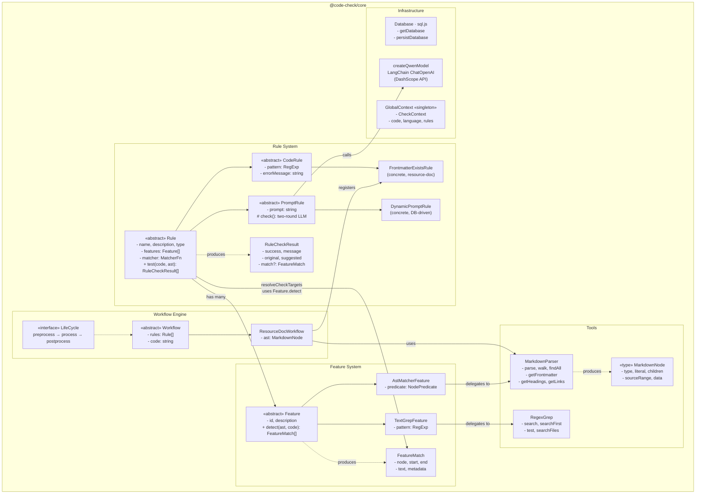

# Code Check Skill — Design Document

## Project Overview

AI-powered code review tool with modular architecture.
Built as a **pnpm monorepo** with four packages: core library, core tests,
REST API server, and React web frontend.

## Repository Structure

```
code-check-skill/
├── packages/
│   ├── core/            # @code-check/core        Core library
│   ├── core-test/       # @code-check/core-test    Core tests (vitest)
│   ├── api/             # @code-check/api          Express.js REST API
│   └── web/             # @code-check/web          React frontend
├── data/                # SQLite database file
├── package.json         # Root workspace config
├── pnpm-workspace.yaml  # pnpm workspace definition
├── tsconfig.base.json   # Shared TypeScript config
├── todo.md              # Development roadmap
└── DESIGN.md            # This file
```

## Tech Stack

| Layer    | Technology                                       |
| -------- | ------------------------------------------------ |
| Core     | TypeScript, LangChain, sql.js, commonmark, yaml  |
| API      | Express.js, SSE, dotenv                          |
| Frontend | React 19, Ant Design, Monaco Editor, Vite        |
| LLM      | Qwen (DashScope OpenAI-compatible API)           |
| Database | SQLite (sql.js, pure JS, no native bindings)     |
| Testing  | Vitest                                           |
| Monorepo | pnpm workspaces                                  |

---

## Core Architecture (`@code-check/core`)

### Module Layout

```
core/src/
├── workflow/
│   ├── workflow.ts                     # Workflow abstract base class
│   ├── types/
│   │   ├── rule/
│   │   │   ├── rule.ts                 # Rule abstract base + RuleCheckResult
│   │   │   ├── code-rule.ts            # CodeRule (pattern-based)
│   │   │   └── prompt-rule.ts          # PromptRule (LLM two-round)
│   │   └── feature/
│   │       ├── feature.ts              # Feature abstract base + FeatureMatch
│   │       └── concrete/
│   │           ├── ast-matcher-feature.ts   # AST node predicate matching
│   │           └── text-grep-feature.ts     # Regex text search
│   ├── implement/
│   │   └── resource-doc/
│   │       ├── resource-doc-workflow.ts     # ResourceDocWorkflow
│   │       └── rules/
│   │           ├── index.ts                 # Rule registry
│   │           └── frontmatter-exists-rule.ts
│   └── context/
│       └── context.ts                  # GlobalContext singleton
├── tools/
│   ├── ast-parser/markdown/            # MarkdownParser (commonmark)
│   └── text-grep/                      # RegexGrep
├── db/
│   └── database.ts                     # SQLite (sql.js)
├── llm/
│   └── model.ts                        # Qwen LLM (LangChain + DashScope)
└── index.ts                            # Unified exports
```

### Architecture Diagram



### Key Design Decisions

#### 1. Three-Layer Abstraction

| Layer        | Responsibility                                           |
| ------------ | -------------------------------------------------------- |
| **Workflow** | Orchestrates the lifecycle `preprocess → process → post` |
| **Rule**     | Defines check logic with Feature-driven target resolving |
| **Feature**  | Detects code patterns, returns `FeatureMatch` locations  |

#### 2. Rule Execution Flow

```
Rule.test(code, ast)
  └─ resolveCheckTargets()
       ├─ No features  → check entire code
       ├─ Has features → Feature.detect(ast, code)
       │                  → collect FeatureMatch[]
       │                  → Matcher decides whether to trigger
       └─ check(matchedText) → RuleCheckResult
```

#### 3. Two Rule Implementation Paths

- **CodeRule** — Pure programmatic check. Fast, local execution.
  Subclasses override `check(code)` with pattern matching or
  custom logic.
- **PromptRule** — Two-round LLM conversation via `createQwenModel()`.
  Round 1: analysis (list violations and fix directions).
  Round 2: structured JSON output (`success`, `message`, `suggested`).

#### 4. Two Feature Implementation Paths

- **AstMatcherFeature** — Traverses the AST via `MarkdownParser.findAll()`
  using a `NodePredicate` function. Requires a pre-parsed AST.
- **TextGrepFeature** — Searches source text via `RegexGrep.search()`.
  AST-independent; works on raw text.

#### 5. Adapter Pattern for FeatureMatch

Both Feature implementations use internal adapters to normalize results
into the unified `FeatureMatch` interface:

- `AstNodeAdapter.toFeatureMatch()` — converts `MarkdownNode` positions
- `RegexMatchAdapter.toFeatureMatch()` — converts `RegexMatch` positions

---

## API Architecture (`@code-check/api`)

Express.js REST server with SSE streaming.

### Endpoints

| Method   | Endpoint         | Description                  |
| -------- | ---------------- | ---------------------------- |
| `GET`    | `/api/rules`     | List all rules               |
| `GET`    | `/api/rules/:id` | Get rule by ID               |
| `POST`   | `/api/rules`     | Create a new rule            |
| `PUT`    | `/api/rules/:id` | Update a rule                |
| `DELETE` | `/api/rules/:id` | Delete a rule                |
| `POST`   | `/api/check`     | Run code check (SSE stream)  |
| `GET`    | `/api/health`    | Health check                 |

### SSE Events (POST /api/check)

```
status  → { status: "running", total: <number> }
result  → { rule_id, rule_name, success, message, original, suggested }
done    → { status: "done", results: [...] }
```

---

## Web Architecture (`@code-check/web`)

React 19 SPA with Ant Design and Monaco Editor.

### Pages

| Route    | Component          | Description              |
| -------- | ------------------ | ------------------------ |
| `/check` | `CodeCheck.tsx`    | Code editor + check UI   |
| `/rules` | `RuleManagement.tsx` | Rule CRUD management   |

### Key Libraries

- **Ant Design** — UI components
- **Monaco Editor** — Code editing with syntax highlighting
- **React Router** — Client-side routing
- **Axios + SSE** — API calls with real-time streaming
- **Vite** — Dev server with API proxy to `localhost:3000`

---

## Current Implementation Status

### Completed

- [x] Rule system (CodeRule / PromptRule / DynamicPromptRule)
- [x] Feature system (AstMatcherFeature / TextGrepFeature)
- [x] Workflow engine with lifecycle
- [x] ResourceDocWorkflow with FrontmatterExistsRule
- [x] Markdown AST parser with frontmatter support
- [x] Regex text search tool
- [x] SQLite database layer
- [x] LLM integration (Qwen via DashScope)
- [x] REST API with SSE streaming
- [x] Web frontend with Monaco Editor

### In Progress

- [ ] End-to-end Markdown check flow (backend done, frontend testing)
- [ ] Rule detail implementation (check scoped code after feature match)

### Planned

- [ ] AI-generated test functions and test cases
- [ ] Web-based Workflow management (create, debug, test)
- [ ] Workflow composition (workflow containing workflow)
- [ ] Visual rule editing (non-critical, deferred)
