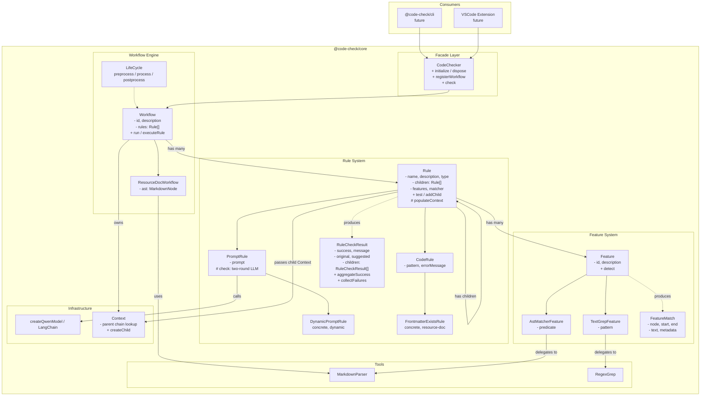

# Code Check Skill — Design Document

## Project Overview

AI-powered code review tool with modular architecture.
Built as a **pnpm monorepo** with two packages: core library and core tests.

The core library exposes a **Facade API** (`CodeChecker` class) so that
consumers — CLI, VSCode extension, etc. — can integrate through a single
high-level interface without duplicating internal orchestration logic.

## Repository Structure

```
code-check-skill/
├── packages/
│   ├── core/            # @code-check/core        Core library
│   └── core-test/       # @code-check/core-test   Core tests (vitest)
├── package.json         # Root workspace config
├── pnpm-workspace.yaml  # pnpm workspace definition
├── tsconfig.base.json   # Shared TypeScript config
├── todo.md              # Development roadmap
└── DESIGN.md            # This file
```

## Tech Stack

| Layer    | Technology                                       |
| -------- | ------------------------------------------------ |
| Core     | TypeScript, LangChain, commonmark, yaml          |
| LLM      | Qwen (DashScope OpenAI-compatible API)           |
| Testing  | Vitest                                           |
| Monorepo | pnpm workspaces                                  |

---

## Core Architecture (`@code-check/core`)

### Module Layout

```
core/src/
├── facade/
│   ├── index.ts                        # Facade module exports
│   ├── code-checker.ts                 # CodeChecker Facade class
│   └── types.ts                        # Facade types & interfaces
├── workflow/
│   ├── workflow.ts                     # Workflow abstract base class
│   ├── types/
│   │   ├── rule/
│   │   │   ├── rule.ts                 # Rule abstract base + RuleCheckResult
│   │   │   ├── code-rule.ts            # CodeRule (pattern-based)
│   │   │   └── prompt-rule.ts          # PromptRule (LLM two-round)
│   │   └── feature/
│   │       ├── feature.ts              # Feature abstract base + FeatureMatch
│   │       └── concrete/
│   │           ├── ast-matcher-feature.ts   # AST node predicate matching
│   │           └── text-grep-feature.ts     # Regex text search
│   ├── implement/
│   │   └── resource-doc/
│   │       ├── resource-doc-workflow.ts     # ResourceDocWorkflow
│   │       └── rules/
│   │           ├── index.ts                 # Rule registry
│   │           └── frontmatter-exists-rule.ts
│   └── context/
│       └── context.ts                  # Context (parent-chain, shared by workflow & rules)
├── tools/
│   ├── ast-parser/markdown/            # MarkdownParser (commonmark)
│   └── text-grep/                      # RegexGrep
├── llm/
│   └── model.ts                        # Qwen LLM (LangChain + DashScope)
└── index.ts                            # Unified exports
```

### Architecture Diagram



### Facade Layer (`CodeChecker`)

The `CodeChecker` class is the single entry point for all consumers.
Rules are bound to Workflows — consumers register Workflows,
then run checks by selecting a Workflow ID.

```typescript
const checker = new CodeChecker({ llm: { apiKey, baseUrl, model } });
await checker.initialize();

checker.registerWorkflow(new ResourceDocWorkflow());

const report = await checker.check({
  code: "# Hello\nContent...",
  workflowId: "resource-doc",
  onRuleResult: (event) => {
    // fires per-rule, useful for SSE / progress bars
  },
});
// report: { workflowId, total, passed, failed, results[] }
```

**Key types:**

| Type                | Purpose                                          |
| ------------------- | ------------------------------------------------ |
| `CodeCheckerConfig` | LLM credentials and options                      |
| `CheckOptions`      | Input code, workflow ID, optional `onRuleResult`  |
| `CheckResultEvent`  | Per-rule result (ruleName, success, message, ...) |
| `CheckReport`       | Aggregated report with pass/fail counts           |
| `WorkflowInfo`      | Workflow metadata (id, description, rule names)   |

### Key Design Decisions

#### 1. Four-Layer Abstraction

| Layer         | Responsibility                                          |
| ------------- | ------------------------------------------------------- |
| **Facade**    | High-level API for all consumers (CodeChecker)          |
| **Workflow**  | Orchestrates the lifecycle `preprocess → process → post`|
| **Rule**      | Defines check logic with Feature-driven target resolving|
| **Feature**   | Detects code patterns, returns `FeatureMatch` locations |

#### 2. Workflow-Centric Design

Rules are bound to Workflows. Each Workflow declares its own `id`,
`description`, and rule set. The Facade dispatches checks by Workflow ID.

```
CodeChecker.check(code, workflowId)
  └─ Workflow.run(code, onRuleComplete)
       ├─ preprocess()         (e.g. parse AST)
       ├─ for each rule:
       │    └─ executeRule(rule) → RuleCheckResult[]
       │       └─ onRuleComplete(ruleResult)
       └─ postprocess()
```

Subclasses override `executeRule()` when rules need extra context
(e.g. `ResourceDocWorkflow` passes the Markdown AST to each rule).

#### 3. Rule Execution Flow (with Child Rules)

```
Rule.test(code, ast, parentCtx?)
  └─ resolveCheckTargets()
       ├─ No features  → check entire code
       ├─ Has features → Feature.detect(ast, code)
       │                  → collect FeatureMatch[]
       │                  → Matcher decides whether to trigger
       └─ check(matchedText) → RuleCheckResult
            └─ if children exist:
                 ├─ create child Context (inherits parent)
                 ├─ populateContext(ctx, code, ast, selfResult)
                 └─ for each child rule:
                      └─ child.test(code, ast, childCtx)
                           → child RuleCheckResult[]
                              attached as result.children
```

**Result aggregation:**

- `RuleCheckResult.aggregateSuccess` — `true` only when self AND all
  descendants succeed (recursive check).
- `RuleCheckResult.collectFailures()` — depth-first collection of all
  failing results across the tree.

**Context (unified, parent-chain):**

- The workflow owns a root `Context`. Each top-level rule gets a child
  context via `context.createChild()`.
- When a parent rule triggers child rules, it creates another child
  context so that intermediate data is scoped per rule subtree.
- Parent rules override `populateContext()` to inject intermediate
  data (e.g. parsed frontmatter fields, matched AST nodes).
- Lookup walks the parent chain: child → parent → ... → workflow root.

#### 4. Two Rule Implementation Paths

- **CodeRule** — Pure programmatic check. Fast, local execution.
  Subclasses override `check(code)` with pattern matching or
  custom logic.
- **PromptRule** — Two-round LLM conversation via `createQwenModel()`.
  Round 1: analysis (list violations and fix directions).
  Round 2: structured JSON output (`success`, `message`, `suggested`).

#### 5. Two Feature Implementation Paths

- **AstMatcherFeature** — Traverses the AST via `MarkdownParser.findAll()`
  using a `NodePredicate` function. Requires a pre-parsed AST.
- **TextGrepFeature** — Searches source text via `RegexGrep.search()`.
  AST-independent; works on raw text.

#### 6. Adapter Pattern for FeatureMatch

Both Feature implementations use internal adapters to normalize results
into the unified `FeatureMatch` interface:

- `AstNodeAdapter.toFeatureMatch()` — converts `MarkdownNode` positions
- `RegexMatchAdapter.toFeatureMatch()` — converts `RegexMatch` positions

---

## Current Implementation Status

### Completed

- [x] Rule system (CodeRule / PromptRule / DynamicPromptRule)
- [x] Feature system (AstMatcherFeature / TextGrepFeature)
- [x] Workflow engine with lifecycle and per-rule callbacks
- [x] ResourceDocWorkflow with FrontmatterExistsRule
- [x] Markdown AST parser with frontmatter support
- [x] Regex text search tool
- [x] LLM integration (Qwen via DashScope)
- [x] CodeChecker Facade (high-level API for multi-consumer support)

### In Progress

- [ ] Rule detail implementation (check scoped code after feature match)

### Planned

- [ ] CLI package (`@code-check/cli`) using CodeChecker Facade
- [ ] VSCode extension using CodeChecker Facade
- [ ] AI-generated test functions and test cases
- [ ] Workflow composition (workflow containing workflow)
